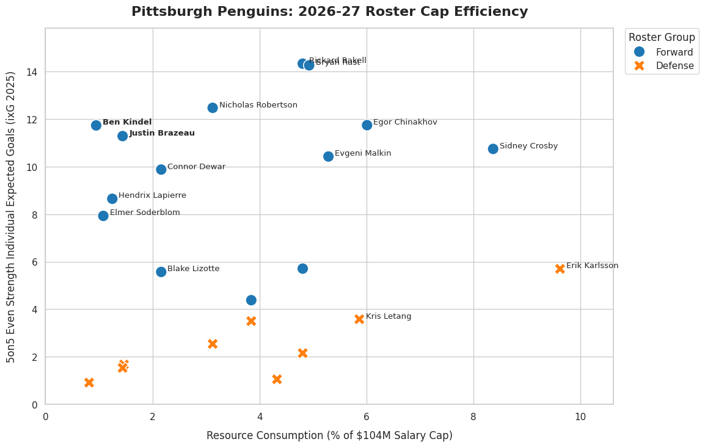

#Pittsburgh Penguins 2026-27 Salary Cap to Individual Expected Goalscoring

##Project Overview
This project builds an analytical data pipeline connecting individual 5on5 scoring in 2025-26 to a players percent cap hit in 2026-27. This model finds surplus value in players who score well above their pay, which is beneficial in the NHL's current CBA with a hard salary cap.

##Framework & Methods
In a hard-cap environment it is imperative for a team to be able to identify players that are undervalued in their current contracts. Therefore, this project helps determine players who are in better goalscoring opportunities in 5on5, with contracts that are considered undervalued for their performance.
***Financial Dataset*** Manually compiled 2026-27 cap hit information extracted from PuckPedia.
***On-Ice Metric*** Sanitized and filtered 5on5 Individual Fenwick Expected Goals from 2025-26 MoneyPuck dataset.

##Key Discoveries
***Cost-Controlled Depth*** This model identified Ben Kindel and Justin Brazeau as the two most efficient 5on5 goalscoring rostered players as of their 2026-27 cap hit compared to their 2025-26 metrics.
***Elite Core*** The visualization maps how legacy players such as Sidney Crosby and Erik Karlsson use more of the salary cap yet are still efficient in their roles.

##Visualizing the roster
Below is the data visualization of the pipeline mapping player cap hit percentage against their on-ice metrics.

## Pipeline Implementation
This pipeline was written in python utilizing the "pandas" library to:
1. Isolate 5on5 scenario where players impact will be shown without the noise of other situations.
2. Apply economic standardization formulas over dynamic currency boundaries.
3. Render a visual model using "matplotlib" and "seaborn".
